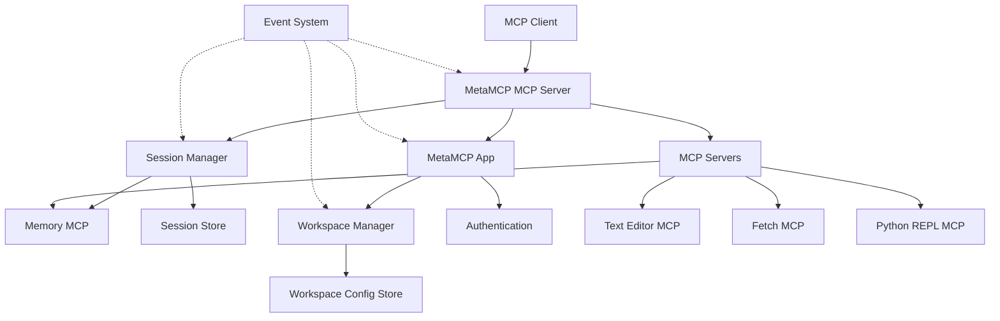

# Architecture Components

## Overview

The MetaMCP extension architecture consists of several key components that work together to provide session persistence, metadata extraction, and workflow automation. This document details each component's responsibilities, interfaces, and implementation considerations.

## Core Components

### MetaMCP MCP Server

**Purpose**: Acts as an intermediary between MCP clients and various MCP servers.

**Responsibilities**:
- Aggregates tools from multiple MCP servers
- Routes tool calls to appropriate target servers
- Handles authentication and authorization
- Manages tool discovery and registration

**Interfaces**:
- MCP Protocol: Communicates with MCP clients
- Internal API: Interacts with MetaMCP App
- MCP Server Protocol: Communicates with MCP servers

**Implementation Considerations**:
- Written in Node.js/TypeScript
- Uses the MCP SDK for protocol handling
- Implements caching for performance optimization
- Provides logging and telemetry

### MetaMCP App

**Purpose**: Provides the user interface and management functionality for the system.

**Responsibilities**:
- Manages workspace configuration
- Provides user interface for system management
- Handles user authentication and settings
- Orchestrates interactions between components

**Interfaces**:
- Web UI: User interface for management
- API: Provides programmatic access to functionality
- Internal API: Communicates with MetaMCP MCP Server

**Implementation Considerations**:
- Frontend built with React/TypeScript
- Backend uses Node.js/Express
- Uses WebSockets for real-time updates
- Implements responsive design for various devices

### Session Manager

**Purpose**: Handles persistence and restoration of session state across token limits.

**Responsibilities**:
- Serializes session context when token limits approach
- Restores relevant context for new sessions
- Maintains workspace-specific context isolation
- Manages session history and versioning

**Interfaces**:
- Internal API: Communicates with MetaMCP MCP Server
- Storage API: Interacts with Session Store
- Memory MCP API: Interacts with Memory MCP

**Implementation Considerations**:
- Implements intelligent context prioritization
- Uses efficient serialization formats
- Provides configurable persistence strategies
- Includes automated cleanup of old sessions

### Metadata System

**Purpose**: Extracts and manages metadata from files and operations.

**Responsibilities**:
- Detects file changes through hash monitoring
- Extracts structured metadata based on file type
- Stores and indexes metadata for rapid retrieval
- Provides metadata for CI/CD and context management

**Interfaces**:
- File Change API: Listens for file modifications
- Storage API: Persists metadata to storage
- Query API: Provides metadata retrieval functionality

**Implementation Considerations**:
- Implements language-specific extractors
- Uses incremental extraction for efficiency
- Provides extensible schema system
- Includes metadata versioning

### CI/CD Pipeline

**Purpose**: Automates testing and validation based on file changes.

**Responsibilities**:
- Generates tests based on metadata
- Executes tests using appropriate environments
- Provides feedback on code quality and functionality
- Creates documentation and reports

**Interfaces**:
- Metadata API: Accesses file metadata
- Test Execution API: Runs tests through MCPs
- Reporting API: Generates feedback reports

**Implementation Considerations**:
- Implements language-specific test generators
- Uses Python REPL MCP for execution
- Provides configurable testing strategies
- Includes performance optimization for fast feedback

## Storage Components

### Session Store

**Purpose**: Persists session state for later restoration.

**Responsibilities**:
- Stores serialized session context
- Provides versioning and history
- Handles workspace-specific storage
- Implements efficient retrieval mechanisms

**Interfaces**:
- Storage API: Provides CRUD operations
- Query API: Enables searching for specific sessions

**Implementation Considerations**:
- Uses file-based storage initially
- Implements compression for efficiency
- Provides encryption for sensitive data
- Includes backup mechanisms

### Metadata Store

**Purpose**: Persists extracted metadata for files and operations.

**Responsibilities**:
- Stores file metadata with versioning
- Indexes metadata for efficient retrieval
- Provides query capabilities for specific attributes
- Maintains historical metadata for trend analysis

**Interfaces**:
- Storage API: Provides CRUD operations
- Query API: Enables searching and filtering

**Implementation Considerations**:
- Uses file-based storage organized by workspace
- Implements JSON format for flexibility
- Provides efficient indexing
- Includes cleanup for outdated metadata

### Workspace Config Store

**Purpose**: Stores workspace configuration and settings.

**Responsibilities**:
- Maintains workspace definitions
- Stores MCP server configurations
- Manages user preferences
- Provides template support

**Interfaces**:
- Storage API: Provides CRUD operations
- Template API: Manages workspace templates

**Implementation Considerations**:
- Uses JSON configuration files
- Implements validation for configuration integrity
- Provides versioning for configuration changes
- Includes import/export functionality

## MCP Server Components

### Text Editor MCP

**Purpose**: Provides file editing capabilities with change detection.

**Responsibilities**:
- Reads and writes files with line precision
- Detects changes through hash comparisons
- Supports partial file operations
- Handles file encoding appropriately

**Interfaces**:
- MCP Protocol: Communicates with MetaMCP MCP Server
- File System API: Interacts with local files

**Implementation Considerations**:
- Written in Python for cross-platform compatibility
- Implements efficient partial file operations
- Provides hash-based conflict detection
- Includes extensive file encoding support

### Fetch MCP

**Purpose**: Retrieves web content in various formats.

**Responsibilities**:
- Fetches HTML, JSON, plain text, and other content
- Converts between formats (e.g., HTML to Markdown)
- Handles authentication and headers
- Implements caching for efficiency

**Interfaces**:
- MCP Protocol: Communicates with MetaMCP MCP Server
- HTTP Client: Interacts with web resources

**Implementation Considerations**:
- Written in TypeScript for efficient web handling
- Uses modern fetch API
- Implements content transformation
- Provides configurable caching

### Python REPL MCP

**Purpose**: Executes Python code with state persistence.

**Responsibilities**:
- Runs Python code in a controlled environment
- Maintains state between executions
- Handles dependencies and packages
- Provides visualization capabilities

**Interfaces**:
- MCP Protocol: Communicates with MetaMCP MCP Server
- Python Interpreter: Executes Python code

**Implementation Considerations**:
- Written in Python for direct interpreter access
- Uses isolated environments for security
- Implements efficient state serialization
- Provides rich output formats (text, images, etc.)

### Memory MCP

**Purpose**: Provides structured memory and context persistence.

**Responsibilities**:
- Stores entities and relationships
- Maintains context across sessions
- Provides query capabilities
- Implements context summarization

**Interfaces**:
- MCP Protocol: Communicates with MetaMCP MCP Server
- Storage API: Persists memory to storage

**Implementation Considerations**:
- Implements entity-relationship model
- Uses efficient serialization formats
- Provides query language for retrieval
- Includes context prioritization algorithms

## Integration Components

### Workspace Manager

**Purpose**: Manages workspace lifecycles and configurations.

**Responsibilities**:
- Creates and configures workspaces
- Manages workspace resources
- Handles workspace switching
- Implements workspace templates

**Interfaces**:
- Internal API: Communicates with MetaMCP App
- Storage API: Interacts with Workspace Config Store

**Implementation Considerations**:
- Implements resource isolation
- Provides template management
- Includes workspace state persistence
- Supports workspace sharing

### Event System

**Purpose**: Facilitates communication between components.

**Responsibilities**:
- Provides event publication and subscription
- Handles event routing and filtering
- Implements event queuing and processing
- Maintains event history

**Interfaces**:
- Publish API: Allows components to emit events
- Subscribe API: Enables components to listen for events

**Implementation Considerations**:
- Uses observer pattern
- Implements efficient event routing
- Provides event persistence
- Includes monitoring and debugging

### Authentication and Authorization

**Purpose**: Manages access control for the system.

**Responsibilities**:
- Authenticates users and systems
- Manages API keys and tokens
- Enforces access controls
- Logs authentication events

**Interfaces**:
- Auth API: Provides authentication services
- Admin API: Manages access control

**Implementation Considerations**:
- Implements secure token handling
- Provides role-based access control
- Includes audit logging
- Supports multiple authentication methods

## Component Interactions

### Session Persistence Flow

1. MetaMCP MCP Server detects approaching token limit
2. Server requests Session Manager to serialize context
3. Session Manager captures relevant context
4. Session Manager uses Memory MCP to store context
5. Memory MCP persists context to Session Store
6. Session Manager confirms successful storage
7. MetaMCP MCP Server notifies client that session can be renewed

### Metadata Extraction Flow

1. Text Editor MCP reports file change with new hash
2. MetaMCP MCP Server notifies Metadata System
3. Metadata System determines file type
4. Metadata System applies appropriate extractor
5. Extractor processes file and generates metadata
6. Metadata System stores results in Metadata Store
7. Metadata System notifies subscribers (CI/CD, Session Manager)

### Test Execution Flow

1. CI/CD Pipeline receives metadata for changed file
2. CI/CD Pipeline generates appropriate tests
3. CI/CD Pipeline uses Python REPL MCP to execute tests
4. Python REPL MCP returns execution results
5. CI/CD Pipeline processes results
6. CI/CD Pipeline generates markdown report
7. CI/CD Pipeline sends report to Text Editor MCP for insertion

## Phase 1 Focus

Phase 1 implementation will focus on these core components:

1. **MetaMCP MCP Server**: Basic tool aggregation and routing
2. **MetaMCP App**: Essential workspace management
3. **Session Manager**: Core persistence and restoration
4. **Memory MCP Integration**: Entity storage and retrieval
5. **Text Editor MCP Integration**: File operations
6. **Fetch MCP Integration**: Web content retrieval
7. **Python REPL MCP Integration**: Code execution

Other components will be implemented in subsequent phases, with some foundational work beginning in Phase 1 to ensure proper architecture for future expansion.

## Component Dependencies

## Component Configuration

Each component will have a standard configuration structure that includes:

- Component identification
- Dependency references
- Feature flags and settings
- Performance tuning parameters
- Logging and monitoring configuration
- Security settings

This standardized approach ensures consistent configuration across the system and simplifies management and troubleshooting.
