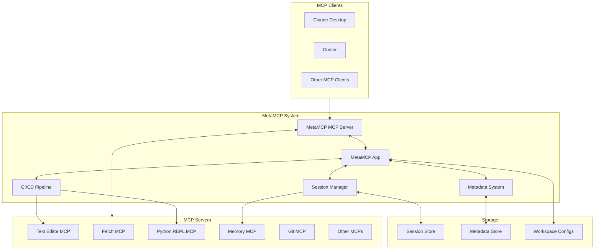
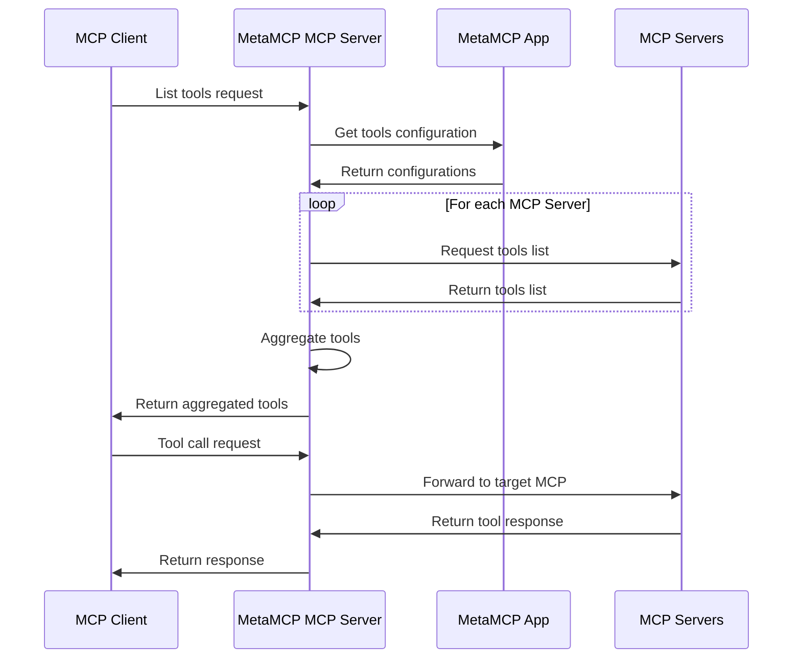
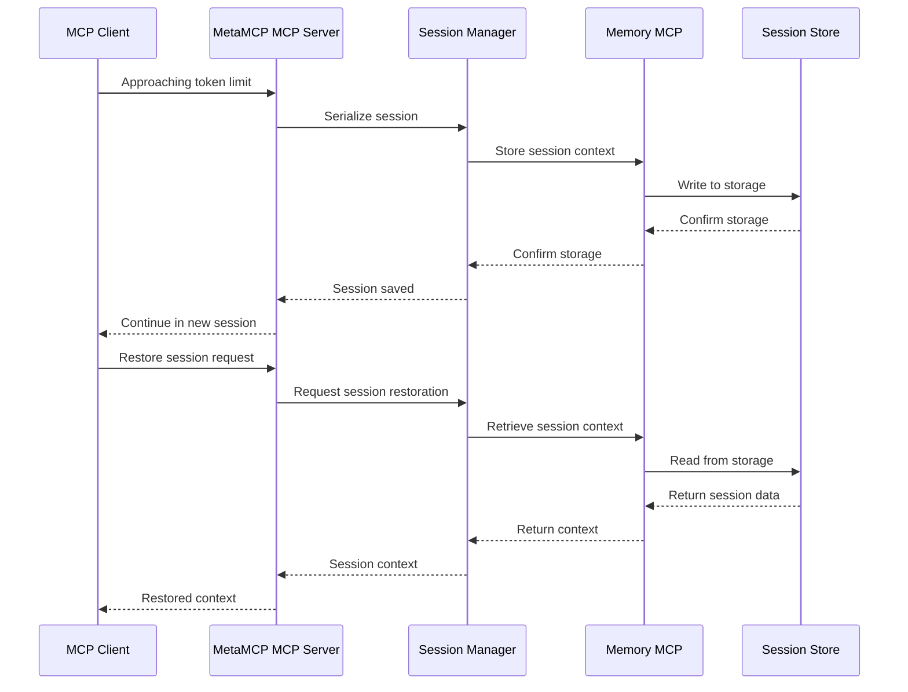
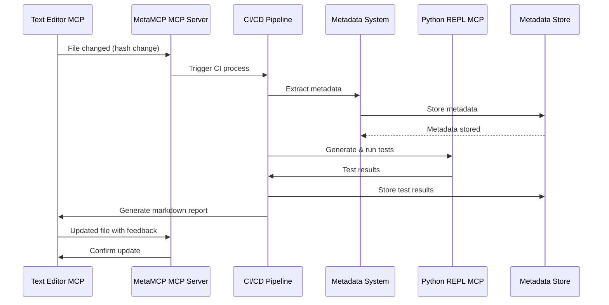
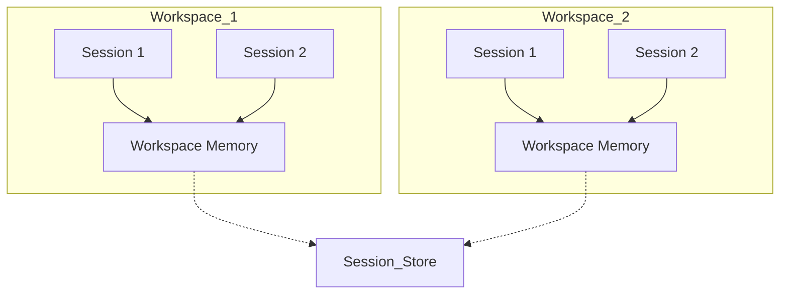
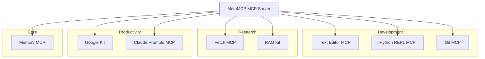

# Architecture Overview

## System Architecture

The MetaMCP extension builds upon the existing MetaMCP architecture, enhancing it with session persistence, integrated DevOps processes, and improved workflow capabilities.

### High-Level Architecture

### Core Components

#### MetaMCP MCP Server

The MetaMCP MCP Server acts as an intermediary between MCP clients (such as Claude Desktop, Cursor, etc.) and the various MCP servers. It aggregates all available tools from the configured MCP servers and routes tool calls to the appropriate target servers.

#### MetaMCP App

The MetaMCP App provides the user interface and management functionality for the system. It allows users to configure workspaces, manage MCP servers, and interact with the system's features.

#### Session Manager

The Session Manager is a new component that handles session persistence across token limits. It works with the Memory MCP to serialize and restore session state, enabling continuous work without context loss.

#### Metadata System

The Metadata System extracts and manages metadata from files and operations. It provides structured information that drives the CI/CD pipeline and supports intelligent context restoration.

#### CI/CD Pipeline

The CI/CD Pipeline component automates testing and validation based on file changes detected through the Text Editor MCP. It generates and runs tests, providing immediate feedback on code quality and functionality.

## Data Flow

### Tool Request Flow

### Session Persistence Flow

### CI/CD Process Flow

## Component Interactions

### Workspace and Session Integration

Workspaces provide isolated environments for different activities. The session persistence feature operates within the context of a workspace, ensuring that when sessions are saved and restored, they maintain the appropriate isolation between different contexts.

### MCP Server Integration

The system integrates various MCP servers to provide comprehensive capabilities. Each MCP server provides specific functionality that can be combined with others to create powerful workflows.

## Key Design Principles

1. **Leverage Existing Infrastructure**: Build upon the current MetaMCP architecture rather than creating new systems from scratch.

2. **Separation of Concerns**: Keep components focused on specific responsibilities to maintain modularity and flexibility.

3. **Progressive Enhancement**: Add features incrementally, ensuring that each stage provides immediate value.

4. **Contextual Isolation**: Maintain clear boundaries between different workspaces to prevent context pollution.

5. **Automation**: Automate repetitive tasks through metadata extraction and testing to accelerate development.

6. **Composability**: Design components that can be easily combined to create powerful workflows.

7. **User Experience**: Focus on seamless experiences that minimize disruption when hitting token limits or switching contexts.

## Technology Stack

- **Backend**: Node.js, TypeScript
- **Frontend**: React, TypeScript
- **Storage**: File-based storage with future database options
- **Integration**: MCP protocol for communication between components
- **Testing**: Language-specific testing frameworks via Python REPL MCP
- **Metadata**: JSON-based schemas with extensibility

## Security Considerations

- **API Key Management**: Secure storage and transmission of API keys
- **File Access Controls**: Appropriate permissions for file operations
- **Workspace Isolation**: Prevention of unauthorized cross-workspace access
- **Session Data Protection**: Secure storage of session state
- **MCP Server Security**: Validation of MCP server operations

## Next Steps

The architecture will be implemented in phases, starting with the core components and expanding to more advanced features. The initial focus will be on:

1. Setting up the base environment
2. Implementing session persistence
3. Integrating core MCP servers (Text Editor, Fetch, Python REPL)
4. Creating the metadata extraction system

For more detailed information on specific components, see:

- [Components](components.md)
- [Data Flow](data-flow.md)
- [Integration Patterns](integration-patterns.md)
