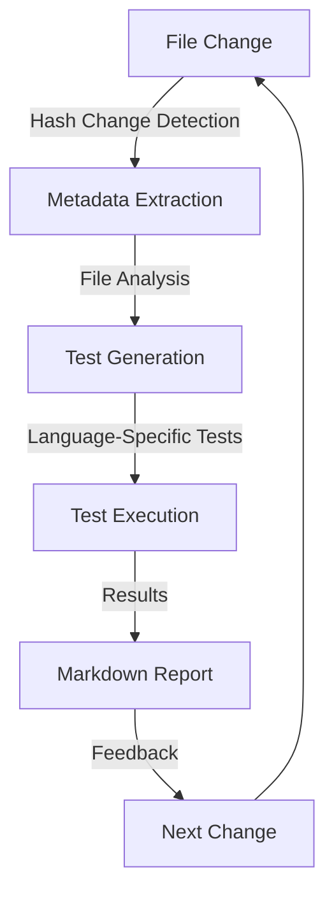
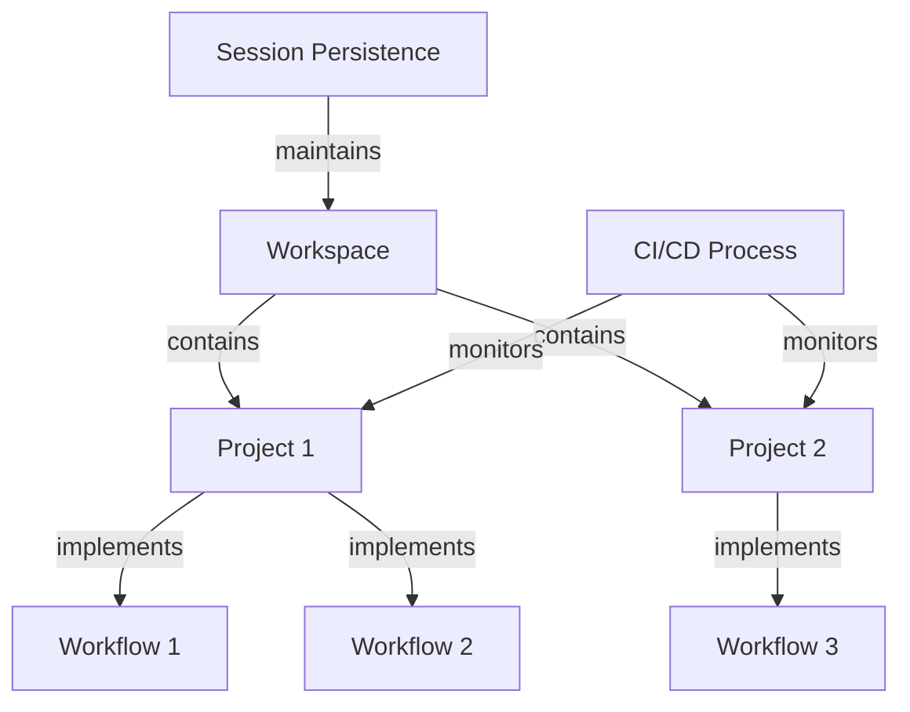

# Core Objects Overview

## Introduction

The MetaMCP extension is built around several core object types that organize and structure the user experience. These objects provide the foundation for representing different operational contexts, projects, and workflows within the system.

## Workspaces

[Workspaces](workspace/structure.md) are the primary containers for different activities or projects. They maintain separate contexts, tools, and resources, allowing users to switch between different operational modes without context contamination.

### Key Aspects of Workspaces

- **Session persistence**: Maintain context continuity within a workspace even when hitting token limits
- **Tool configuration**: Customize available MCP tools per workspace needs
- **Resource isolation**: Prevent context pollution between different activities
- **Quick switching**: Seamlessly transition between different operational contexts

## Projects

[Projects](project/structure.md) represent specific endeavors within a workspace. Each project has its own configuration, resources, and context. Projects help organize related work and maintain focused access to relevant resources.

### Key Aspects of Projects

- **Repository connections**: Link to specific code repositories
- **File access controls**: Define which files and directories are accessible
- **Project-specific memory**: Maintain context relevant to the specific project
- **Resource configuration**: Configure database connections, API keys, and other resources

## Workflows

[Workflows](workflow/structure.md) define sequences of operations that accomplish specific tasks. They can be created, customized, and shared, providing reusable patterns for common activities.

### Key Aspects of Workflows

- **Operation sequences**: Define structured sequences of MCP operations
- **Parameterization**: Customize workflow behavior for different contexts
- **Shareability**: Reuse workflows across projects and workspaces
- **Templates**: Pre-configured workflows for common tasks

### Example Workflows

- [Development Workflow](workflow/examples/development.md): Code development, testing, and deployment
- [Capital Raise Workflow](workflow/examples/capital-raise.md): Investment research, pitch deck creation, and outbound communication
- [Job Application Workflow](workflow/examples/job-applications.md): Resume tailoring, company research, and application tracking

## CI/CD Integration

A key enhancement to these core objects is the integration of DevOps/DataOps processes that provide immediate feedback through metadata extraction and automated testing:

1. **Change Detection**: When files change (detected through hash changes in the text editor MCP), the system triggers automated processes
2. **Metadata Extraction**: The system extracts relevant metadata based on file type and content
3. **Automated Testing**: Language-appropriate tests are generated and executed
4. **Feedback Loop**: Results are presented in markdown format for immediate review

This process creates a tight feedback loop that accelerates development and ensures quality:

## Object Relationships

The relationship between these objects is hierarchical but flexible:

Workspaces contain projects, which implement workflows. CI/CD processes monitor projects, and session persistence maintains workspace context. This structure provides organization while enabling powerful automation and context maintenance.

## Customization and Extension

All core objects are designed to be customizable and extensible:

- **Workspace Properties**: Can be extended to support new context types and tool configurations
- **Project Properties**: Can be customized for different development environments, research topics, or business activities
- **Workflow Definitions**: Can be created for any sequence of operations that benefits from automation

## Learn More

- [Workspace Structure and Properties](workspace/structure.md)
- [Project Configuration](project/structure.md)
- [Workflow Development](workflow/structure.md)
- [CI/CD Integration](../features/ci-cd/overview.md)
