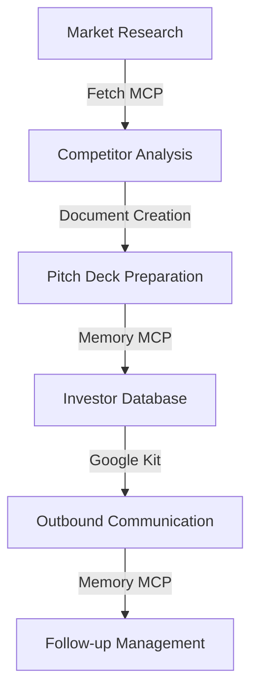

# Capital Raise Workflow Example

## Overview

The Capital Raise workflow accelerates the process of preparing materials for fundraising and managing investor communications. This workflow combines multiple MCP tools to streamline the entire fundraising process from market research to investor follow-up.

## Workflow Stages



## Integrated MCPs

This workflow combines several MCPs working in concert:

### Research Phase

- **Fetch MCP**: Gathers market and competitor data from the web
- **RAG Kit**: Analyzes market reports and financial data using retrieval-augmented generation
- **Markdownify MCP**: Converts web content into structured, processable formats

### Preparation Phase

- **Memory MCP**: Maintains context about market positioning and competitive landscape
- **Claude Prompts MCP**: Generates tailored pitch material based on research
- **Text Editor MCP**: Creates and refines pitch deck content and financial models

### Outreach Phase

- **Google Kit**: Manages outbound communications through Gmail and Google Calendar
- **Memory MCP**: Tracks investor interactions and preferences
- **Python REPL MCP**: Runs analysis on investor responses and engagement metrics

## Value Proposition

The Capital Raise workflow accelerates fundraising by:

1. **Automating Research**: Rapidly collecting and analyzing market data
2. **Ensuring Consistency**: Maintaining consistent messaging across all materials
3. **Personalizing Communications**: Tailoring outreach to specific investors
4. **Maintaining Context**: Preserving the history of all investor interactions
5. **Optimizing Follow-up**: Timing and tailoring follow-up communications

## Customization Options

The workflow can be customized with:

- **Target Investor Profiles**: Defining investor segments and preferences
- **Company Financial Data**: Incorporating financial models and projections
- **Market Positioning**: Defining competitive advantages and market opportunity
- **Fundraising Timeline**: Setting milestones and deadlines
- **Communication Templates**: Creating reusable communication formats

## Implementation

### Setup Requirements

- Access to Fetch MCP for web research
- Google Kit configured with appropriate Gmail account
- Memory MCP with investor database schema
- Claude Prompts MCP with pitch deck templates

### Configuration Example

```json
{
  "workflow": "capital-raise",
  "phases": [
    {
      "name": "research",
      "mcps": ["fetch", "rag-kit", "markdownify"],
      "outputs": ["market-analysis.md", "competitor-profiles.md"]
    },
    {
      "name": "preparation",
      "mcps": ["memory", "claude-prompts", "text-editor"],
      "outputs": ["pitch-deck.pptx", "financial-model.xlsx"]
    },
    {
      "name": "outreach",
      "mcps": ["google-kit", "memory", "python-repl"],
      "outputs": ["investor-tracking.md", "engagement-metrics.md"]
    }
  ],
  "parameters": {
    "company-name": "Example Inc.",
    "funding-round": "Series A",
    "target-amount": "$5M",
    "investor-focus": ["FinTech", "AI", "Enterprise SaaS"]
  }
}
```

## Metrics and Analytics

The workflow automatically tracks key metrics:

- **Research Depth**: Number of sources analyzed
- **Investor Reach**: Number of investors contacted
- **Response Rate**: Percentage of investors who respond
- **Meeting Conversion**: Percentage of responses that lead to meetings
- **Time Efficiency**: Time spent on each phase of the process

## Example Use Cases

- **Seed Round Fundraising**: Initial company funding with angel investors
- **Series Funding**: Institutional rounds with venture capital firms
- **Strategic Investor Outreach**: Targeted outreach to specific strategic partners
- **Follow-on Funding**: Additional rounds from existing investors

## Best Practices

1. **Start with Research**: Build a solid foundation of market understanding
2. **Personalize Outreach**: Tailor communications to each investor's interests
3. **Track Everything**: Maintain detailed records of all interactions
4. **Iterate Materials**: Continuously improve pitch materials based on feedback
5. **Follow Up Strategically**: Time follow-ups based on engagement patterns

## Session Persistence Integration

The Capital Raise workflow leverages session persistence to maintain context across the entire fundraising process, which can span weeks or months. This ensures that:

- Research insights are preserved and accessible
- Investor interactions are tracked completely
- Context is maintained even across multiple team members
- The narrative remains consistent throughout the process
