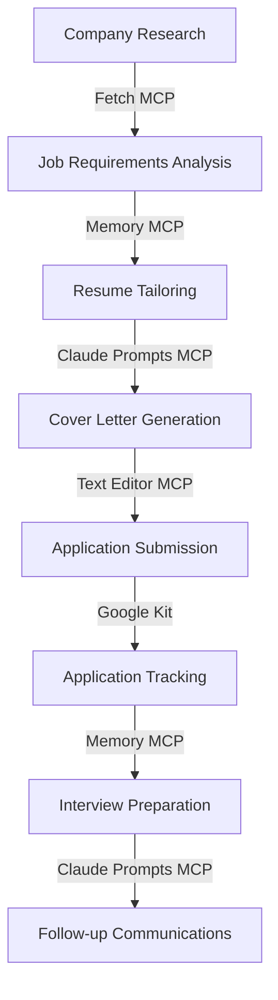

# Job Applications Workflow Example

## Overview

The Job Applications workflow accelerates and optimizes the job search process by automating research, document creation, application tracking, and follow-up communications. This workflow integrates multiple MCPs to create a comprehensive system for managing a job search campaign.

## Workflow Stages



## Integrated MCPs

This workflow combines several MCPs working together:

### Research Phase

- **Fetch MCP**: Gathers company information and job details from websites
- **RAG Kit**: Analyzes job descriptions and company profiles
- **Markdownify MCP**: Converts web content into structured format

### Document Preparation Phase

- **Memory MCP**: Maintains context about job requirements and candidate qualifications
- **Claude Prompts MCP**: Generates tailored resumes and cover letters
- **Text Editor MCP**: Edits and refines application documents

### Application and Follow-up Phase

- **Google Kit**: Manages email communications and calendar for interviews
- **Memory MCP**: Tracks application status and interactions
- **Python REPL MCP**: Analyzes application metrics and success patterns

## Value Proposition

The Job Applications workflow accelerates the job search process by:

1. **Automating Research**: Quickly gathering and analyzing company and job information
2. **Personalizing Documents**: Creating tailored resumes and cover letters for each application
3. **Optimizing Applications**: Ensuring application materials align with job requirements
4. **Organizing Tracking**: Maintaining a comprehensive system for application status
5. **Improving Follow-up**: Creating timely and appropriate follow-up communications

## Customization Options

The workflow can be customized with:

- **Candidate Profile**: Skills, experience, education, and career objectives
- **Target Industries**: Preferred sectors and company types
- **Job Preferences**: Role types, seniority levels, and requirements
- **Application Strategy**: Volume vs. targeted approach
- **Communication Templates**: Personalized templates for different communication types

## Implementation

### Setup Requirements

- Access to Fetch MCP for web research
- Google Kit configured with appropriate Gmail account
- Memory MCP with application tracking schema
- Claude Prompts MCP with resume and cover letter templates

### Configuration Example

```json
{
  "workflow": "job-applications",
  "phases": [
    {
      "name": "research",
      "mcps": ["fetch", "rag-kit", "markdownify"],
      "outputs": ["company-profile.md", "job-requirements.md"]
    },
    {
      "name": "preparation",
      "mcps": ["memory", "claude-prompts", "text-editor"],
      "outputs": ["tailored-resume.pdf", "cover-letter.pdf"]
    },
    {
      "name": "application",
      "mcps": ["google-kit", "memory", "python-repl"],
      "outputs": ["application-tracker.md", "follow-up-schedule.md"]
    }
  ],
  "parameters": {
    "candidate-name": "Jane Smith",
    "target-roles": ["Software Engineer", "Backend Developer", "Full Stack Developer"],
    "experience-level": "Mid-level",
    "target-locations": ["Remote", "San Francisco", "New York"]
  }
}
```

## Metrics and Analytics

The workflow automatically tracks key metrics:

- **Application Volume**: Number of applications submitted
- **Response Rate**: Percentage of applications receiving responses
- **Interview Conversion**: Percentage of applications leading to interviews
- **Offer Rate**: Percentage of interviews resulting in offers
- **Time Efficiency**: Average time spent per application

## Example Use Cases

- **Graduate Job Search**: First job after college or graduate school
- **Career Transition**: Moving to a new industry or role type
- **Senior Position Search**: Executive or leadership role applications
- **Remote Work Campaign**: Focused search for remote opportunities

## Best Practices

1. **Research Thoroughly**: Understand company culture and job requirements
2. **Customize Deeply**: Tailor each application to the specific opportunity
3. **Track Meticulously**: Maintain detailed records of all applications and interactions
4. **Follow Up Strategically**: Time follow-ups appropriately and maintain professional tone
5. **Analyze Patterns**: Use metrics to refine application strategy over time

## Session Persistence Integration

The Job Applications workflow leverages session persistence to maintain context across the entire job search process, which can span weeks or months. This ensures that:

- Company and job research is preserved and accessible
- Application status and history is maintained
- Interview preparation builds on previous interactions
- The overall job search strategy evolves based on outcomes

## Integration with Other Workflows

The Job Applications workflow can integrate with:

- **Research Workflow**: For deep industry and company analysis
- **Networking Workflow**: For connection building and referral opportunities
- **Skill Development Workflow**: For addressing skill gaps identified during job search
- **Career Planning Workflow**: For long-term career strategy and positioning
