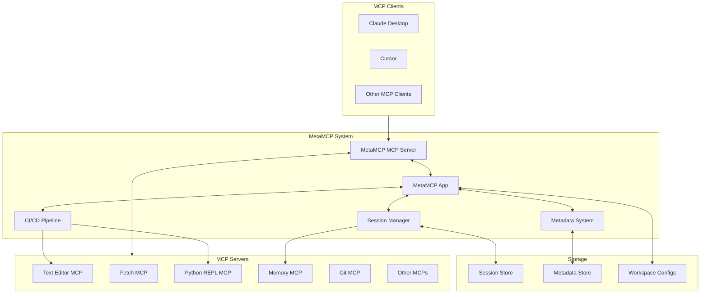
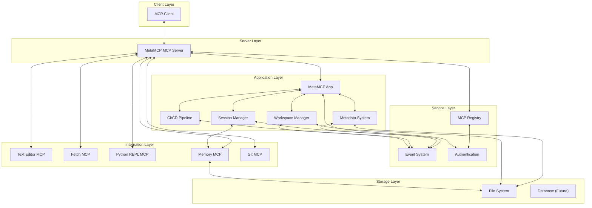
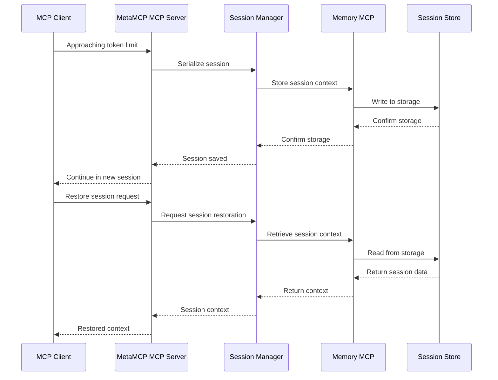
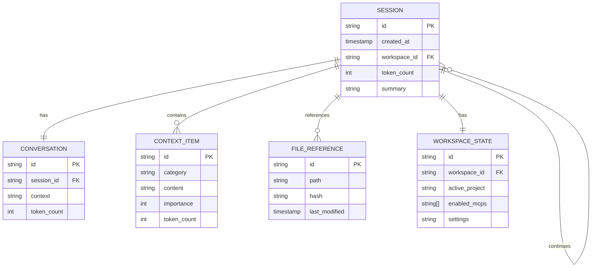
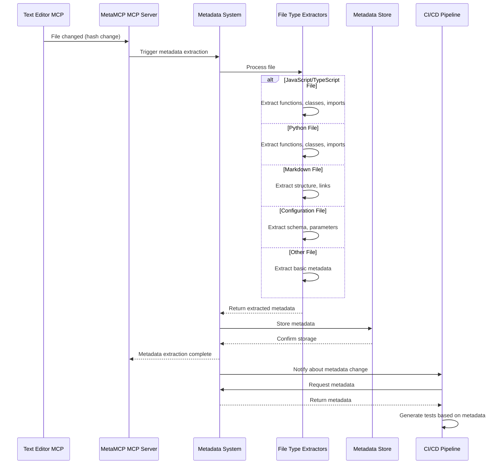
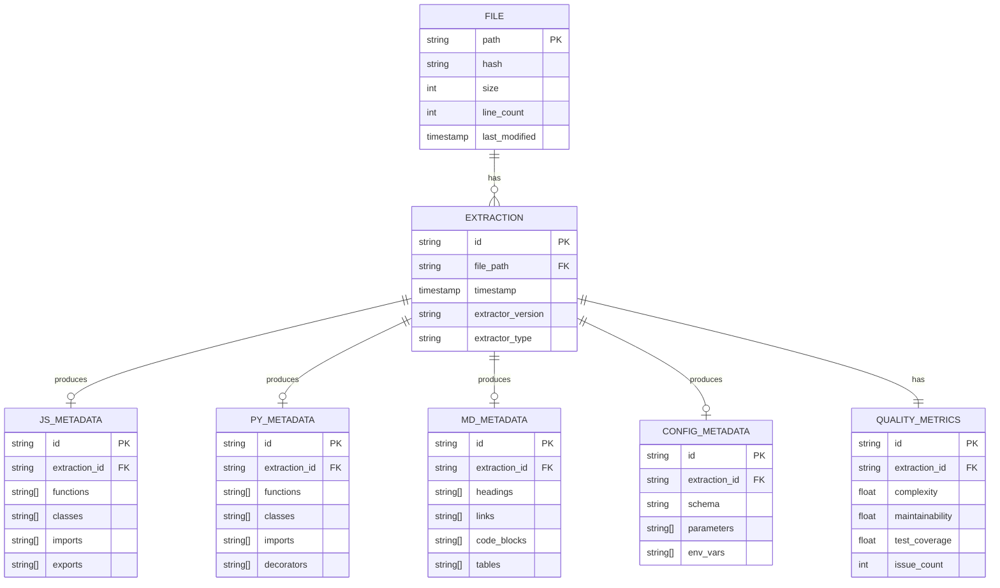
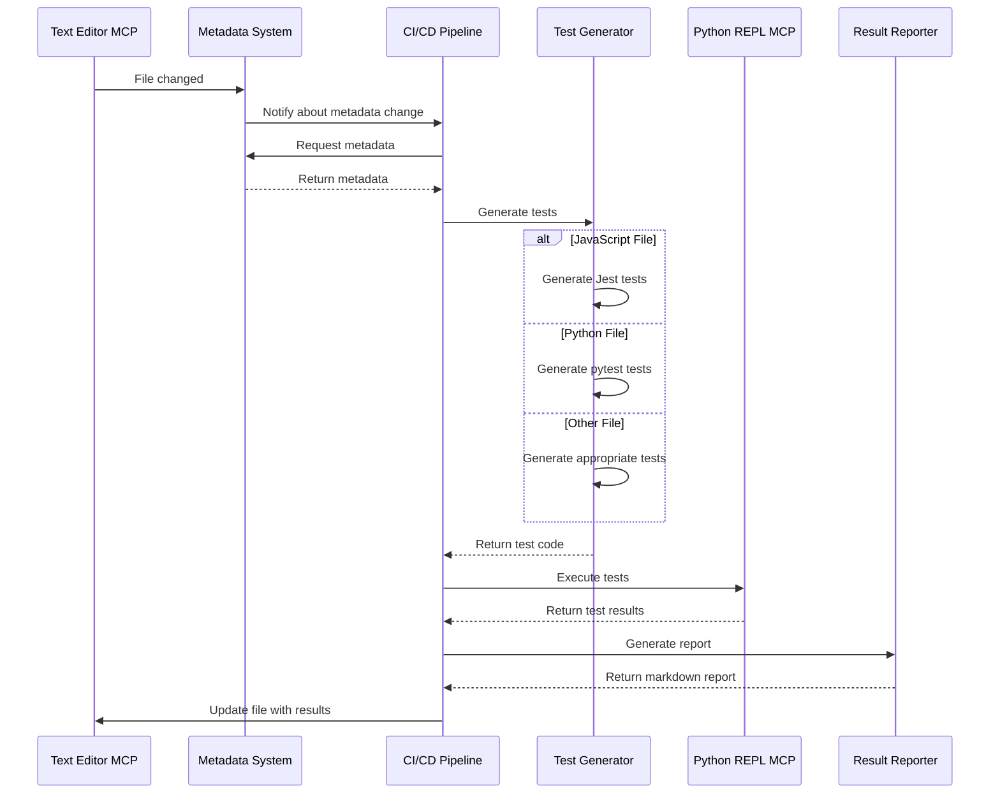
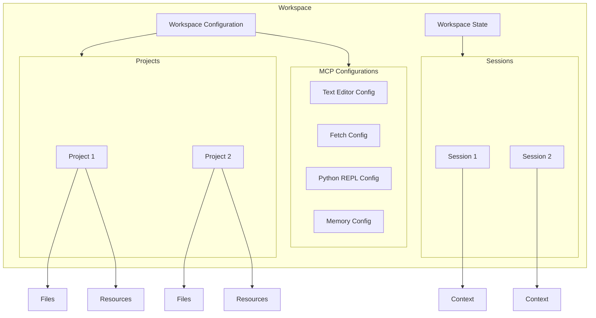
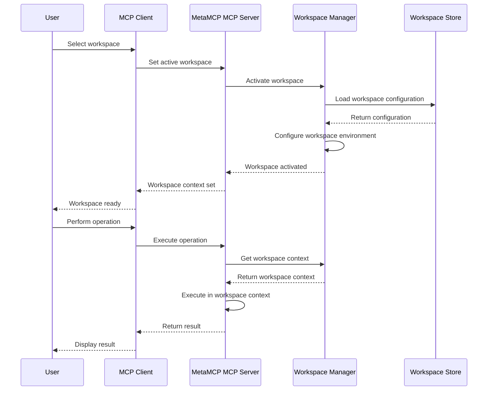

# Architecture Diagrams

## System Architecture

### High-Level Architecture



### Component Interactions



## Session Persistence Architecture

### Session Persistence Flow



### Session Data Model



## Metadata Extraction Architecture

### Metadata Extraction Flow



### Metadata Schema



## CI/CD Pipeline Architecture

### CI/CD Process Flow



## Workspace Management Architecture

### Workspace Structure



### Workspace Interaction



## Phase 1 Implementation Focus

```mermaid
flowchart TD
    subgraph Phase_1["Phase 1: Foundation"]  
        Base["Base Setup"]
        Session["Session Persistence"]
        Core_MCP["Core MCP Integration"]
        Basic_WF["Basic Workflow"]
    end
    
    subgraph Components["Implemented Components"]  
        MMCP_Server["MetaMCP MCP Server"]
        MMCP_App["MetaMCP App"]
        Session_Manager["Session Manager"]
        Memory_MCP["Memory MCP"]
        Text_Editor["Text Editor MCP"]
        Fetch["Fetch MCP"]
        Python_REPL["Python REPL MCP"]
    end
    
    Base --> MMCP_Server
    Base --> MMCP_App
    
    Session --> Session_Manager
    Session --> Memory_MCP
    
    Core_MCP --> Text_Editor
    Core_MCP --> Fetch
    Core_MCP --> Python_REPL
    
    Basic_WF --> Session_Manager
    Basic_WF --> Text_Editor
    Basic_WF --> Fetch
    Basic_WF --> Python_REPL
```
