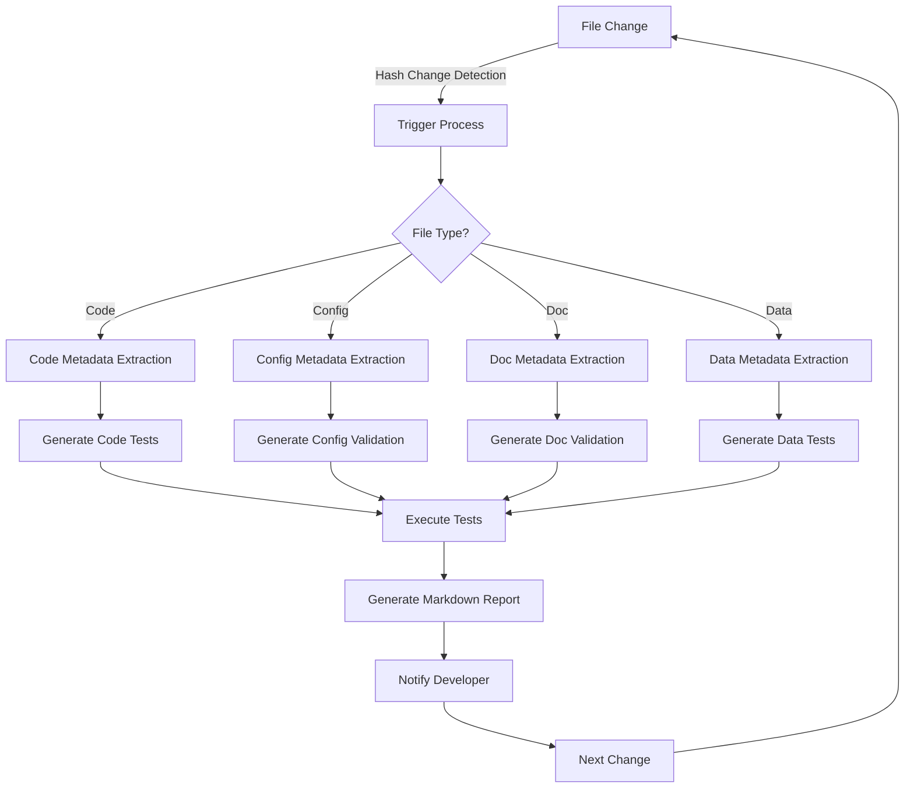

# CI/CD Integration Overview

## Introduction

The CI/CD integration feature of MetaMCP provides DevOps/DataOps-like processes that generate immediate feedback from metadata and tests after code changes. Rather than waiting for a traditional CI pipeline to run remotely, this feature brings the power of continuous integration directly into the development workflow.

## Core Concept

The central idea is to create a tight feedback loop between code changes and validation, enabling developers to make informed decisions based on automatically generated metadata and test results. This approach accelerates development by providing immediate insights into the impact of changes.

## Key Components

### Metadata Extraction

Whenever a file changes (detected via hash changes in the text editor MCP), the system automatically extracts relevant metadata based on file type:

- **Code Files**: Function signatures, dependencies, complexity metrics
- **Configuration Files**: Parameter definitions, environment settings
- **Documentation**: Structure, references, completeness
- **Data Files**: Schema, statistics, validity

This metadata is stored in a structured format that can be easily queried and visualized.

### Automated Testing

Based on the extracted metadata, the system generates and executes appropriate tests:

- **Unit Tests**: For functions and methods
- **Integration Tests**: For component interactions
- **Validation Tests**: For data and configuration
- **Static Analysis**: For code quality and security

These tests are executed automatically and results are captured for immediate feedback.

### Results Visualization

Test and analysis results are presented in markdown format, making them easy to review directly in the context of the development environment:

- **Summary Views**: High-level overview of pass/fail status
- **Detailed Reports**: In-depth analysis of specific issues
- **Trend Analysis**: Changes in metrics over time
- **Recommendation Engine**: Suggested improvements

## Process Flow

## Integration with MCPs

This feature leverages several MCP servers working together:

- **Text Editor MCP**: Detects file changes and provides content
- **Python REPL MCP**: Executes tests and analysis
- **Git MCP**: Provides historical context for changes
- **Memory MCP**: Maintains context about the codebase

## Benefits

- **Immediate Feedback**: No waiting for remote CI processes
- **Contextual Awareness**: Tests and analysis consider the specific project context
- **Reduced Friction**: Testing happens automatically without developer effort
- **Better Decisions**: More information available at the time of coding
- **Quality Improvement**: Issues caught earlier in the development process

## Configuration and Customization

The CI/CD integration can be configured at different levels:

- **Workspace-level**: Default behaviors for all projects
- **Project-level**: Project-specific testing strategies
- **File-level**: Custom rules for specific file types or paths

Customization options include:

- **Test Generation Rules**: How tests are created for different code patterns
- **Validation Criteria**: Standards for different file types
- **Notification Settings**: When and how developers are notified
- **Report Formats**: How results are presented

## Advanced Features

- **Intelligent Test Generation**: Using AI to create meaningful tests
- **Impact Analysis**: Understanding what other code might be affected by changes
- **Predictive Quality**: Identifying potential issues before they manifest
- **Learning from History**: Using past issues to prevent future problems

## Learn More

- [Implementation Details](implementation.md)
- [Workflow Integration](workflow.md)
- [Metadata Schemas](../metadata-extraction/schemas.md)
- [Testing Framework](../../development/testing.md)
