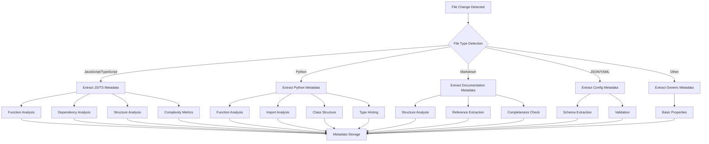

# Metadata Extraction Overview

## Introduction

The Metadata Extraction system is a core component of the MetaMCP extension that automatically analyzes files when they change, extracting structured information that drives testing, documentation, and decision-making processes. This system enables the CI/CD pipeline and provides rich context for development activities.

## Purpose and Value

Metadata extraction serves several critical purposes:

1. **Supporting Automated Testing**: Extracted metadata drives test generation, ensuring appropriate test coverage
2. **Providing Development Context**: Helps developers understand code structure and dependencies
3. **Documenting Changes**: Automatically tracks how files evolve over time
4. **Enabling Quality Metrics**: Generates data for measuring code quality and complexity
5. **Facilitating Intelligent Memory**: Provides structured data for session persistence

## Extraction Process



## File Type Handlers

The system includes specialized handlers for different file types:

### JavaScript/TypeScript Handler

Extracts:
- Function signatures and parameters
- Class definitions and inheritance
- Import/export relationships
- JSDoc comments
- Complexity metrics (cyclomatic complexity, etc.)
- React component structure

### Python Handler

Extracts:
- Function definitions and docstrings
- Class hierarchies
- Import statements
- Type hints
- Decorators
- Global variables

### Markdown Handler

Extracts:
- Document structure (headings, sections)
- Links and references
- Code blocks and their languages
- Completeness metrics
- Table structures

### Configuration Handler (JSON/YAML)

Extracts:
- Schema information
- Environment variables
- Configuration parameters
- Validation results

### Generic Handler

Provides basic metadata for unsupported file types:
- File size
- Line count
- Modification history
- Basic text statistics

## Metadata Schema

Extracted metadata follows a structured schema to ensure consistency and usability. The base schema includes:

```json
{
  "fileInfo": {
    "path": "string",
    "hash": "string",
    "size": "number",
    "lineCount": "number",
    "lastModified": "timestamp"
  },
  "extractionInfo": {
    "timestamp": "timestamp",
    "extractorVersion": "string",
    "extractorType": "string"
  },
  "contentMetadata": {
    // Type-specific metadata goes here
  },
  "qualityMetrics": {
    // Quality-related metrics
  },
  "testingHints": {
    // Information useful for test generation
  }
}
```

Each file type has specific schemas for the `contentMetadata` section. For example, JavaScript files include function signatures, class definitions, etc.

## Integration with Other Features

### CI/CD Integration

The metadata extraction system triggers the CI/CD pipeline, providing the necessary information for test generation and execution. The pipeline:

1. Receives metadata about changed files
2. Determines what tests to run based on the metadata
3. Generates test cases using the extracted information
4. Executes tests and reports results

### Session Persistence

Metadata helps the session persistence feature by:

1. Providing structured information about code changes
2. Identifying key pieces of context to preserve
3. Enabling intelligent restoration of context

### Workspace Management

Metadata extraction operates within workspace boundaries, ensuring that:

1. Extraction is relevant to the current workspace context
2. Metadata is stored and managed per workspace
3. Cross-workspace pollution is prevented

## Event-Driven Architecture

The metadata extraction system uses an event-driven architecture to respond to file changes:

1. Text Editor MCP emits a file change event with the new hash
2. Metadata System captures the event and triggers extraction
3. Appropriate handler processes the file based on type
4. Extracted metadata is stored and published as an event
5. Subscribers (CI/CD, Session Manager, etc.) respond to the metadata event

## Storage and Retrieval

Metadata is stored in a structured format for easy retrieval:

- File-based storage organized by workspace and file path
- JSON format for flexible schema evolution
- Historical metadata maintained for trend analysis
- Efficient querying for specific metadata attributes

## Performance Considerations

The metadata extraction system is designed to be lightweight and non-intrusive:

- Extraction runs asynchronously to avoid blocking user operations
- Incremental extraction focuses on changed portions of files
- Caching reduces redundant extraction
- Configurable extraction depth controls processing time

## Extensibility

The system is designed to be extensible in several ways:

1. **New File Types**: Additional handlers can be added for new file types
2. **Custom Extractors**: Users can define custom extraction rules
3. **Plugin Architecture**: Third-party plugins can extend extraction capabilities
4. **Schema Evolution**: Metadata schemas can evolve while maintaining backward compatibility

## Learn More

- [Implementation Details](implementation.md)
- [Metadata Schemas](schemas.md)
- [CI/CD Integration](../ci-cd/overview.md)
- [Session Persistence](../session-persistence/overview.md)
