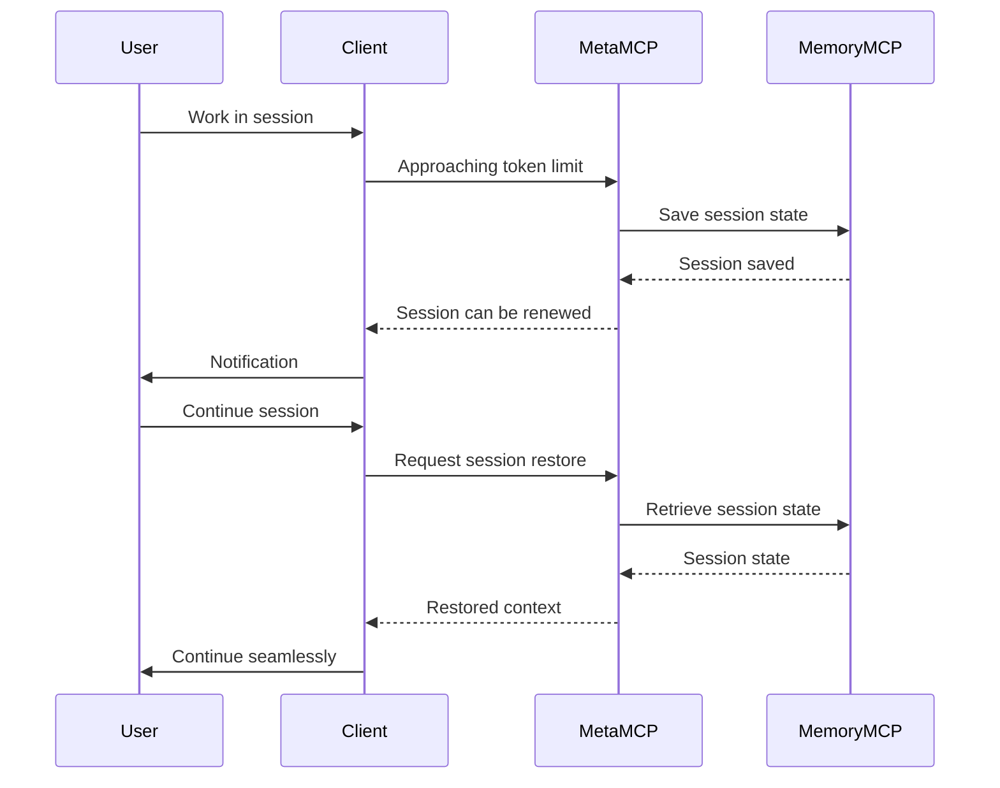

# Session Persistence Overview

## Introduction

Session persistence is a core feature of the MetaMCP extension that allows users to continue their work seamlessly when a chat session runs out of tokens. This feature addresses one of the primary limitations in LLM-based assistance tools - the context window constraint.

## Problem Statement

LLM-based assistants like Claude are limited by their context window size (token limits). When a conversation grows beyond this limit, one of two things typically happens:

1. The assistant loses access to earlier parts of the conversation
2. The user must start a new conversation, losing all context

This limitation is particularly problematic for complex development tasks, research activities, or any workflow that requires maintaining context over extended periods.

## Solution: Session Persistence

The session persistence feature solves this problem by:

1. **Serializing critical context** - Capturing important information before token limits are reached
2. **Storing this context** in a structured, retrievable format
3. **Restoring relevant context** when a new session begins

## Key Components

### Memory MCP Integration

The session persistence feature is built on top of the Memory MCP, which provides:

- Entity-based memory storage
- Relationship tracking
- Context summarization
- Selective retrieval

### Implementation Status

✅ **Memory MCP Server Installed**: We have successfully integrated the official Memory MCP server from the MCP protocol team, providing robust knowledge graph-based persistent memory.

```json
{
  "memory": {
    "command": "npx",
    "args": ["-y", "@modelcontextprotocol/server-memory"],
    "description": "Knowledge graph-based persistent memory with entity and relation management, observation storage, and graph querying.",
    "type": "STDIO"
  }
}
```

This server implementation enables:
- Entity and relation management for structured memory
- Observation storage for tracking interactions
- Graph querying for intelligent context retrieval
- Session persistence across token limits and conversations

### Workspace-Specific Memory

Memory is organized by workspace, ensuring:

- Isolation between different projects/contexts
- Appropriate context for the current activity
- Prevention of context pollution

### Serialization/Deserialization

The system includes:

- Smart context serialization that prioritizes critical information
- Efficient storage formats that minimize token usage
- Fast retrieval mechanisms for session restoration

## Usage Flow



## Benefits

- **Continuity**: Work all day without losing context
- **Efficiency**: No need to rebuild context in new sessions
- **Productivity**: Maintain flow without interruption
- **Reliability**: Never lose important information due to token limits

## Advanced Features

- **Context Prioritization**: Intelligent selection of what to persist
- **Memory Summarization**: Compact representation of context
- **Selective Restoration**: Only bring back relevant context
- **Cross-Session References**: Link related sessions together

## Memory MCP Technical Details

The Memory MCP server implements the following core functionalities:

### Entity Management

Entities represent concepts, objects, or contexts that need to be tracked:

```json
{
  "id": "project-123",
  "type": "project",
  "properties": {
    "name": "MetaMCP Integration",
    "status": "in-progress"
  }
}
```

### Relationship Tracking

Relationships connect entities in meaningful ways:

```json
{
  "source": "project-123",
  "target": "task-456",
  "type": "contains"
}
```

### Observation Storage

Observations capture events, interactions, and changes:

```json
{
  "entity": "task-456",
  "timestamp": "2025-03-19T14:30:00Z",
  "content": "Updated documentation for Memory MCP"
}
```

### Query Capabilities

The Memory MCP supports rich querying for context retrieval:

- Entity retrieval by ID or properties
- Relationship traversal
- Temporal queries (recent observations)
- Relevance-based retrieval

## Integration with Other Features

Session persistence integrates with:

- **Workspace Management**: Maintaining separate contexts per workspace
- **MCP Tools**: Preserving tool state and output
- **Metadata System**: Tracking changes and history
- **Python REPL MCP**: Preserving Python execution state between sessions

## Learn More

- [Implementation Details](implementation.md)
- [Usage Guide](usage.md)
- [Memory MCP Documentation](../../mcp-integration/categories/productivity/task-management.md#memory-mcp)
