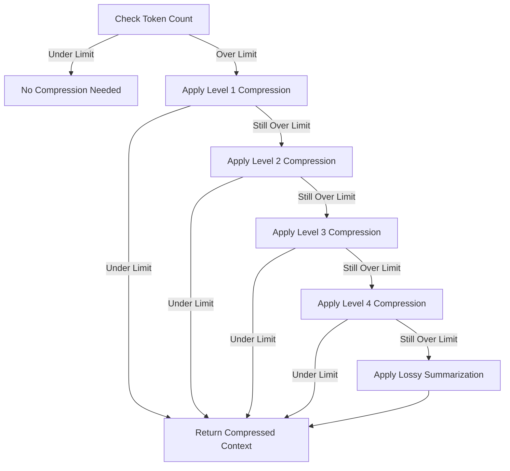

# Token-Aware Context Management

## Overview

Token-aware context management is a critical component of MetaMCP's session persistence strategy. It ensures that context is efficiently preserved and restored across sessions while respecting token limits. This feature enables users to work on complex tasks over extended periods without losing important context due to token limitations.

## Key Concepts

### Token Counting

Accurate token counting is essential for effective context management. The system uses model-specific tokenizers to accurately count tokens across different content types:

```typescript
function countTokens(text: string, modelName: string = 'claude-3'): number {
  // Use model-specific tokenizers for accurate counting
  switch (modelName) {
    case 'claude-3':
      return claudeTokenizer.count(text);
    case 'gpt-4':
      return gptTokenizer.count(text);
    default:
      return approximateTokenCount(text);
  }
}
```

This enables precise token budget management tailored to the specific model being used.

### Token Budget Allocation

The system intelligently allocates token budgets across different content types based on their relevance and importance:

```typescript
function allocateTokenBudget(totalBudget: number, contextTypes: string[]): Record<string, number> {
  // Smart budget allocation based on context types and user preferences
  const budget: Record<string, number> = {};
  
  // Different allocations for different session types
  if (contextTypes.includes('code')) {
    // Development session allocation
    budget.code = Math.floor(totalBudget * 0.6);
    budget.conversation = Math.floor(totalBudget * 0.3);
    budget.metadata = Math.floor(totalBudget * 0.1);
  } else if (contextTypes.includes('research')) {
    // Research session allocation
    budget.sources = Math.floor(totalBudget * 0.5);
    budget.conversation = Math.floor(totalBudget * 0.3);
    budget.notes = Math.floor(totalBudget * 0.2);
  } else {
    // Default allocation
    budget.conversation = Math.floor(totalBudget * 0.7);
    budget.metadata = Math.floor(totalBudget * 0.3);
  }
  
  return budget;
}
```

This approach ensures that the most relevant content is preserved within the available token budget.

### Smart Compression Strategies

When context exceeds token limits, the system applies progressive compression strategies to fit within the budget while preserving as much meaning as possible:



Compression levels include:

1. **Whitespace Optimization**: Remove redundant whitespace, normalize indentation
2. **Comment Removal**: Strip non-essential comments while preserving docstrings
3. **Format Simplification**: Convert complex data formats to simpler representations
4. **Selective Inclusion**: Keep only the most relevant sections of large files
5. **Hierarchical Summarization**: Create multi-level summaries with different levels of detail

## Implementation

### Dynamic Token Counting

```typescript
class TokenCounter {
  private modelTokenizer: Tokenizer;
  
  constructor(modelName: string) {
    this.modelTokenizer = this.getTokenizerForModel(modelName);
  }
  
  countTokens(text: string): number {
    return this.modelTokenizer.encode(text).length;
  }
  
  estimateCompletion(prompt: string, expectedResponseLength: number): number {
    const promptTokens = this.countTokens(prompt);
    // Use model-specific estimation formula
    return promptTokens + expectedResponseLength;
  }
  
  private getTokenizerForModel(modelName: string): Tokenizer {
    // Return appropriate tokenizer implementation
    // Could use tiktoken, sentencepiece, or other tokenizers
  }
}
```

### Adaptive Compression

```typescript
class ContextCompressor {
  compressContext(context: string, targetTokens: number, tokenCounter: TokenCounter): string {
    const currentTokens = tokenCounter.countTokens(context);
    
    if (currentTokens <= targetTokens) {
      return context; // No compression needed
    }
    
    // Apply progressive compression strategies
    let compressedContext = context;
    const compressionStrategies = [
      this.removeRedundantWhitespace,
      this.removeComments,
      this.simplifyFormatting,
      this.selectiveInclude,
      this.summarizeSections
    ];
    
    for (const strategy of compressionStrategies) {
      compressedContext = strategy(compressedContext);
      if (tokenCounter.countTokens(compressedContext) <= targetTokens) {
        return compressedContext;
      }
    }
    
    // If still over limit, apply lossy summarization
    return this.lossy(compressedContext, targetTokens, tokenCounter);
  }
  
  // Compression strategy implementations...
}
```

### Token-Aware Code Extraction

For code contexts, the system implements specialized extraction logic:

```typescript
function extractRelevantCode(filePath: string, targetTokens: number): string {
  const fullCode = fs.readFileSync(filePath, 'utf8');
  const tokenCount = tokenCounter.countTokens(fullCode);
  
  if (tokenCount <= targetTokens) {
    return fullCode; // Return full code if within token limit
  }
  
  // Parse code structure
  const ast = parseCode(fullCode);
  
  // Find relevant sections based on usage patterns
  const importantSections = findImportantSections(ast);
  
  // Extract and combine sections to fit token budget
  return extractSections(fullCode, importantSections, targetTokens);
}
```

## Vector Similarity for Context Prioritization

To enhance context prioritization, the system uses vector embeddings to determine the semantic relevance of content:

```typescript
async function prioritizeByRelevance(query: string, contextItems: ContextItem[]): Promise<ContextItem[]> {
  // Generate embedding for query
  const queryEmbedding = await generateEmbedding(query);
  
  // Generate or retrieve embeddings for context items
  const itemsWithEmbeddings = await Promise.all(
    contextItems.map(async item => ({
      ...item,
      embedding: item.embedding || await generateEmbedding(item.content),
      similarity: 0 // Will be calculated
    }))
  );
  
  // Calculate similarity scores
  for (const item of itemsWithEmbeddings) {
    item.similarity = calculateCosineSimilarity(queryEmbedding, item.embedding);
  }
  
  // Sort by similarity
  return [...itemsWithEmbeddings].sort((a, b) => b.similarity - a.similarity);
}
```

This approach is particularly valuable for:

- Linking API documentation with related code
- Finding conceptually related code elements
- Determining which context items are most relevant to the current task

## Importance Scoring System

The system uses a multi-factor scoring system to determine the importance of context items:

```typescript
function scoreImportance(item: ContextItem, currentTask: string): number {
  let score = 0;
  
  // Recency factor (0-10 points)
  const hoursSinceLastAccess = (Date.now() - item.lastAccessTime) / (1000 * 60 * 60);
  score += Math.max(0, 10 - hoursSinceLastAccess); 
  
  // Frequency factor (0-10 points)
  score += Math.min(10, item.accessCount); 
  
  // Semantic relevance (0-20 points)
  if (item.embedding && currentTask) {
    const taskEmbedding = getTaskEmbedding(currentTask);
    const relevance = calculateCosineSimilarity(taskEmbedding, item.embedding);
    score += relevance * 20; 
  }
  
  // User-marked importance (0-10 points)
  score += (item.userImportance || 0) * 2; // Scale 0-5 to 0-10
  
  // Type-specific bonus
  switch (item.type) {
    case 'code':
      score += 5; // Code often needs more context
      break;
    case 'api':
      score += 3; // API references are important
      break;
    case 'data':
      score += 2; // Data structures can be important
      break;
  }
  
  return score;
}
```

This scoring system ensures that the most important context is preserved when token limits are reached.

## Integration with MCP Servers

The token-aware context management system integrates with several MCP servers to enhance its capabilities:

### Python MCP Integration

The Python MCP provides token-aware Python code extraction:

```typescript
async function extractPythonContext(filePath: string, targetTokens: number): Promise<string> {
  // Use Python MCP to extract code with import relationship awareness
  const response = await pythonMcpClient.callTool('get_python_code', {
    target_file: filePath,
    token_limit: targetTokens
  });
  
  return response.code;
}
```

### AiDD MCP Integration

The AiDD MCP enhances context management with multi-language code analysis:

```typescript
async function getCodeContextWithAiDD(filePath: string, targetTokens: number): Promise<string> {
  // Use AiDD's tree-sitter analysis to extract most relevant code sections
  const response = await aiddMcpClient.callTool('tree_sitter_map', {
    path: filePath
  });
  
  // Use the code map to extract the most important sections
  return extractImportantSections(filePath, response.codeMap, targetTokens);
}
```

## Testing and Feedback Loops

The system includes automated testing and feedback loops to continuously improve token efficiency:

### Automated Testing

```bash
#!/bin/bash
# test-token-efficiency.sh

# Parameters
CONTENT_TYPE=${1:-"code"}
COMPRESSION_LEVEL=${2:-"adaptive"}
TOKEN_BUDGET=${3:-8000}

# Run test
node scripts/token-efficiency-test.js \
  --content-type ${CONTENT_TYPE} \
  --compression-level ${COMPRESSION_LEVEL} \
  --token-budget ${TOKEN_BUDGET} \
  --output-dir test_results/${CONTENT_TYPE}_${COMPRESSION_LEVEL}_${TOKEN_BUDGET}/

# Analyze results
node scripts/analyze-token-usage.js \
  --results-dir test_results/${CONTENT_TYPE}_${COMPRESSION_LEVEL}_${TOKEN_BUDGET}/ \
  --generate-report
```

### Performance Metrics

The system tracks key performance metrics to guide optimization:

- **Token Efficiency**: Ratio of semantic content to token usage
- **Context Preservation**: How well original meaning is preserved after compression
- **Retrieval Accuracy**: How well the system retrieves the most relevant context
- **Compression Speed**: Time required to compress context to target token count

## User Interface

The token-aware context management system provides user interface elements to visualize token usage and control context priorities:

- **Token Usage Gauge**: Visual indicator of current token usage
- **Context Priority Controls**: Interface for adjusting context priorities
- **Content Type Allocation**: Visual breakdown of token allocation by content type
- **Context Preservation Settings**: Controls for adjusting compression and preservation strategies

## Conclusion

Token-aware context management is a critical capability for enabling extended interactions with LLMs. By intelligently managing token usage, prioritizing the most important context, and applying smart compression strategies, MetaMCP enables seamless continuity across sessions despite the inherent token limitations of current AI models.

This approach not only preserves important context but also optimizes token usage to maximize the value derived from each interaction, making it possible to maintain complex, long-running conversations and development sessions.
