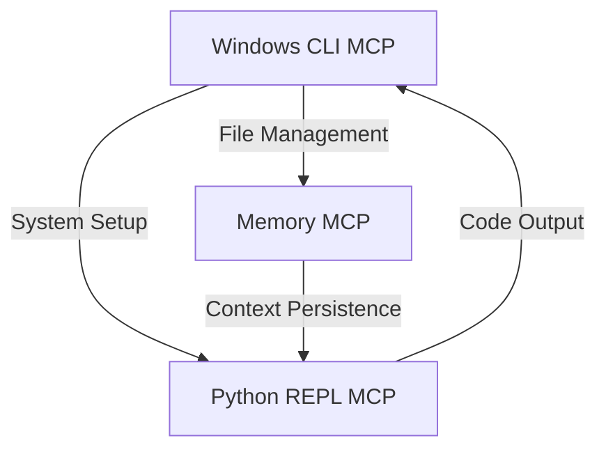
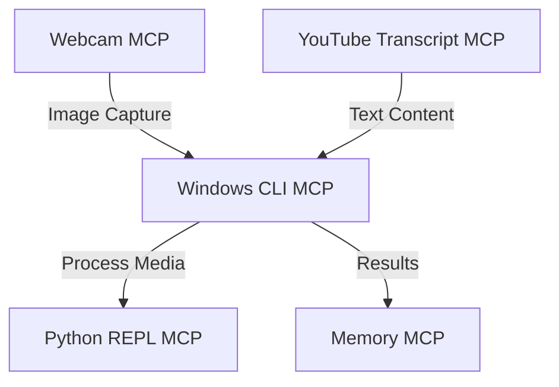

# Windows Command Line Tools

## Overview

The Windows Command Line MCP provides secure, programmatic access to the Windows terminal environment. This MCP enables interaction with multiple shell types, command execution, and system management from within the MetaMCP environment.

## Available Command Line MCPs

### Windows CLI MCP

✅ **Status**: Installed and configured

**Description**: A powerful, secure command-line interaction tool for Windows systems with multi-shell support and robust security controls.

**Configuration**:
```json
{
  "win-cli": {
    "command": "npx",
    "args": ["-y", "@simonb97/server-win-cli"],
    "description": "Secure Windows command-line interaction with multi-shell support and robust security controls.",
    "type": "STDIO"
  }
}
```

**Key Features**:
- **Multi-Shell Support**: Execute commands in PowerShell, Command Prompt (CMD), and Git Bash
- **Security Controls**: 
  - Command and argument blocking
  - Working directory validation
  - Command length limits
  - Command logging and history tracking
- **SSH Support**: Execute commands on remote systems via SSH (requires configuration)
- **Resource Exposure**: View SSH connections, current directory, and configuration

**Example Usage**:

```javascript
// Execute PowerShell command
const output = await executeCommand({
  shell: "powershell",
  command: "Get-Process | Sort-Object CPU -Descending | Select-Object -First 5",
  workingDir: "C:\\Projects"
});

// Execute command in CMD
const dirOutput = await executeCommand({
  shell: "cmd",
  command: "dir /a",
  workingDir: "C:\\Users\\YourUsername\\Documents"
});

// Get command history
const history = await getCommandHistory({ limit: 10 });
```

**Use Cases**:
- System administration and management
- File operations and manipulation
- Process management and monitoring
- Development environment setup
- Batch operations and automation

## Security Considerations

The Windows CLI MCP implements several security features to protect your system:

- **Command Blocking**: Prevents execution of potentially dangerous commands
- **Argument Blocking**: Blocks known dangerous command arguments
- **Directory Restriction**: Limits command execution to specified directories
- **Command Injection Protection**: Prevents command chaining through shell operators
- **Command Length Limits**: Restricts maximum command length
- **Command Logging**: Records all executed commands for auditing

## Integration with Other MCPs

The Windows CLI MCP integrates seamlessly with other MCPs to create powerful workflows:

### Windows CLI + Python REPL

Combine Windows CLI with Python REPL for enhanced development capabilities:



### Windows CLI + Webcam + YouTube Transcript

Create a multimedia processing workflow:



## Advanced Configuration

The Windows CLI MCP can be configured with a custom configuration file for more advanced settings:

1. Generate a default configuration:
   ```bash
   npx @simonb97/server-win-cli --init-config ./win-cli-config.json
   ```

2. Edit the configuration to meet your needs

3. Update the import-config.json to use your custom configuration:
   ```json
   "win-cli": {
     "command": "npx",
     "args": ["-y", "@simonb97/server-win-cli", "--config", "./win-cli-config.json"],
     "description": "Secure Windows command-line interaction with custom configuration.",
     "type": "STDIO"
   }
   ```

## Best Practices

- Maintain a restrictive set of blocked commands and arguments
- Limit working directories to necessary locations only
- Review command history regularly for unexpected usage patterns
- Configure separate SSH connections for different environments
- Use the most restrictive shell for each operation
- Combine with Python REPL MCP for enhanced scripting capabilities
