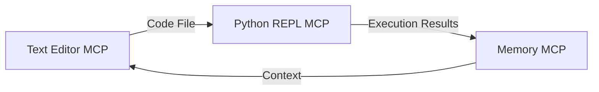
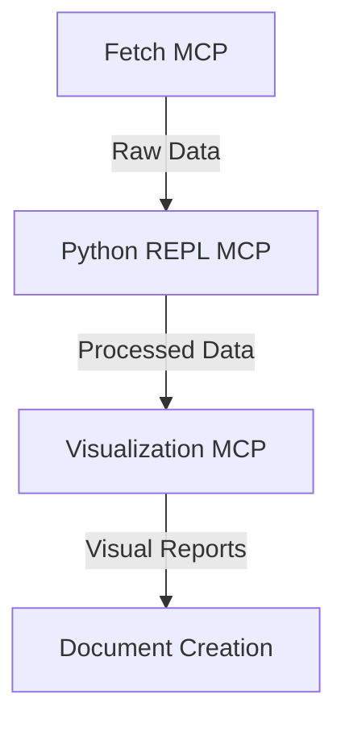

# REPL Environments

## Overview

REPL (Read-Eval-Print Loop) environments in MetaMCP provide interactive code execution capabilities, allowing users to write, test, and debug code directly within their workflow. These environments are essential for development tasks, data analysis, and testing code snippets without switching to external tools.

## Available REPL MCPs

### Python REPL MCP

✅ **Status**: Installed and configured

**Description**: The Python REPL MCP provides an interactive Python execution environment directly within MetaMCP, enabling real-time code execution with state persistence.

**Configuration**:
```json
{
  "python-repl": {
    "command": "uv",
    "args": ["run", "python-local"],
    "description": "Interactive Python REPL environment for running Python code directly with session state maintenance.",
    "type": "STDIO"
  }
}
```

**Key Features**:
- Run Python code directly within MetaMCP
- Maintain session state between executions
- Capture stdout/stderr for analysis
- Integrate with other MCPs for seamless workflows
- Supports standard Python libraries and imports

**Example Usage**:

```python
# Import libraries
import pandas as pd
import numpy as np
import matplotlib.pyplot as plt

# Create a sample dataframe
df = pd.DataFrame({
    'x': np.random.randn(100),
    'y': np.random.randn(100)
})

# Display statistics
print(df.describe())

# Create a visualization
plt.figure(figsize=(8, 6))
plt.scatter(df['x'], df['y'])
plt.title('Sample Scatter Plot')
plt.xlabel('X Axis')
plt.ylabel('Y Axis')
plt.grid(True)
plt.show()
```

**Use Cases**:
- Data analysis and visualization
- Algorithm testing and development
- Script development and debugging
- Machine learning model prototyping
- API testing and interaction

### Planned REPL Environments

#### JavaScript REPL MCP

**Status**: Planned

**Description**: Interactive JavaScript execution environment for web development tasks.

**Key Features**:
- Execute JavaScript code
- Support for popular libraries
- DOM manipulation capabilities
- Integration with web development workflows

#### R REPL MCP

**Status**: Planned

**Description**: R language execution environment for statistical computing and data analysis.

**Key Features**:
- R language code execution
- Statistical analysis capabilities
- Data visualization support
- Integration with data analysis workflows

## Integration with Other MCPs

REPL environments integrate seamlessly with other MCPs to create powerful workflows:

### Python REPL + Text Editor

Write code in the Text Editor MCP and execute it in the Python REPL MCP for a complete development cycle:



### Python REPL + Data MCPs

Combine Python REPL with data-oriented MCPs for analysis workflows:



## Session Persistence

The Python REPL MCP supports state persistence across sessions through integration with Memory MCP:

1. Variables, functions, and classes defined in one session can be preserved
2. Data structures and computation results can be maintained
3. Module imports and configurations can be persisted

This enables long-running analysis and development tasks to continue even when hitting token limits or starting new sessions.

## Best Practices

### Code Organization

- Keep code modular and well-commented
- Use functions to encapsulate reusable logic
- Store intermediate results for complex computations

### Performance Considerations

- Be mindful of memory usage for large datasets
- Consider chunking operations for large data processing
- Cache results of expensive computations

### Security Notes

- The REPL environment executes code with the same permissions as the MetaMCP process
- Avoid executing untrusted code or sensitive operations
- Be careful with file system operations

## Future Enhancements

- Support for additional programming languages
- Enhanced visualization capabilities
- Package and dependency management
- Code completion and linting
- Debugging tools
