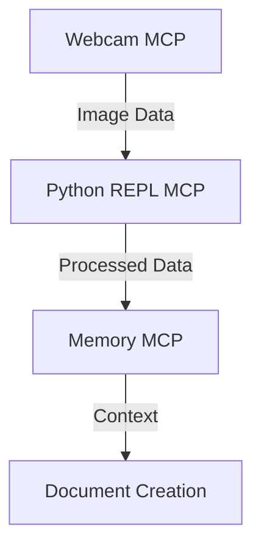
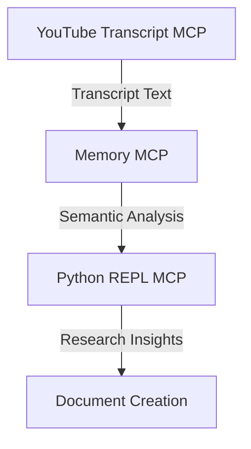

# Web & Content Fetch Tools

## Overview

Web and content fetch tools in MetaMCP provide capabilities for retrieving information from various sources, processing multimedia content, and extracting valuable data. These tools enable research, content creation, and information gathering without leaving your workflow.

## Available Web & Content Fetch MCPs

### Webcam MCP

✅ **Status**: Installed and configured

**Description**: The Webcam MCP provides access to your computer's camera, allowing you to capture images and incorporate visual information into your workflow.

**Configuration**:
```json
{
  "webcam": {
    "command": "npx",
    "args": ["-y", "@llmindset/mcp-webcam"],
    "description": "Capture live images from webcam with screenshot capability and image processing capabilities.",
    "type": "STDIO"
  }
}
```

**Key Features**:
- Live webcam access for visual input
- Screenshot capabilities for capturing specific moments
- Image freezing and manipulation
- Integration with other MCPs for visual data processing

**Example Usage**:

```javascript
// Capture an image from the webcam
const image = await captureImage();

// Process the image for analysis
const processedData = await processImage(image);

// Use the processed data in your workflow
console.log(processedData);
```

**Use Cases**:
- Visual documentation of physical objects
- Real-time visual input for AI analysis
- Capturing diagrams and whiteboard content
- Visual verification of physical systems
- Demo recordings and tutorials

### YouTube Transcript MCP

✅ **Status**: Installed and configured

**Description**: The YouTube Transcript MCP extracts subtitles and transcripts from YouTube videos, providing textual content from video sources.

**Configuration**:
```json
{
  "youtube-transcript": {
    "command": "npx",
    "args": ["-y", "@kimtaeyoon83/mcp-server-youtube-transcript"],
    "description": "YouTube transcript extraction with multiple language support and URL processing for content analysis.",
    "type": "STDIO"
  }
}
```

**Key Features**:
- Extract subtitles from YouTube videos
- Support for multiple languages
- Transcript formatting options
- Integration with text analysis workflows

**Example Usage**:

```javascript
// Extract transcript from a YouTube video
const transcript = await getTranscript('https://www.youtube.com/watch?v=example');

// Format the transcript for better readability
const formattedTranscript = formatTranscript(transcript);

// Use the transcript in your workflow
console.log(formattedTranscript);
```

**Use Cases**:
- Research on video content
- Content summarization and analysis
- Educational material extraction
- Media monitoring and analysis
- Accessibility improvements

### Planned Web & Content Fetch Tools

#### Fetch MCP

**Status**: Planned

**Description**: General-purpose web content retrieval tool for fetching web pages, APIs, and online resources.

**Key Features**:
- Web page content retrieval
- API access and integration
- Content parsing and extraction
- HTTP request customization

#### Markdownify MCP

**Status**: Planned

**Description**: Convert various file formats to Markdown for consistent content processing.

**Key Features**:
- PDF to Markdown conversion
- Image to text with OCR
- Document format standardization
- Content extraction from complex formats

## Integration with Other MCPs

Web and content fetch tools integrate seamlessly with other MCPs to create powerful workflows:

### Visual Content Analysis

Combine Webcam MCP with Python REPL MCP for visual data analysis:



### Video Content Research

Combine YouTube Transcript MCP with Memory MCP for comprehensive video research:



## Best Practices

### Webcam Usage

- Ensure proper lighting for optimal image quality
- Position camera appropriately for the content you're capturing
- Consider privacy implications when capturing images
- Store captured images securely if they contain sensitive information

### Transcript Processing

- Verify transcript accuracy against the original video when critical
- Process large transcripts in chunks for better performance
- Consider language nuances when working with translated transcripts
- Combine transcript analysis with other sources for comprehensive research

## Future Enhancements

- Advanced image processing capabilities
- Real-time video analysis
- Multi-language transcript analysis
- Integration with more multimedia sources
- Enhanced OCR and document processing
