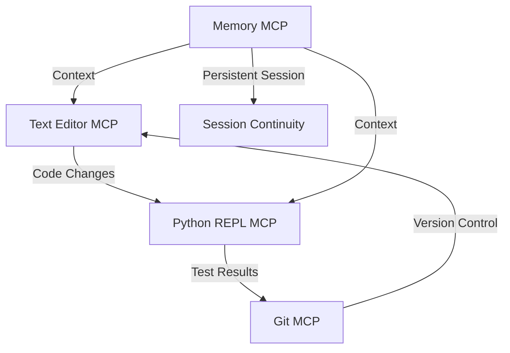
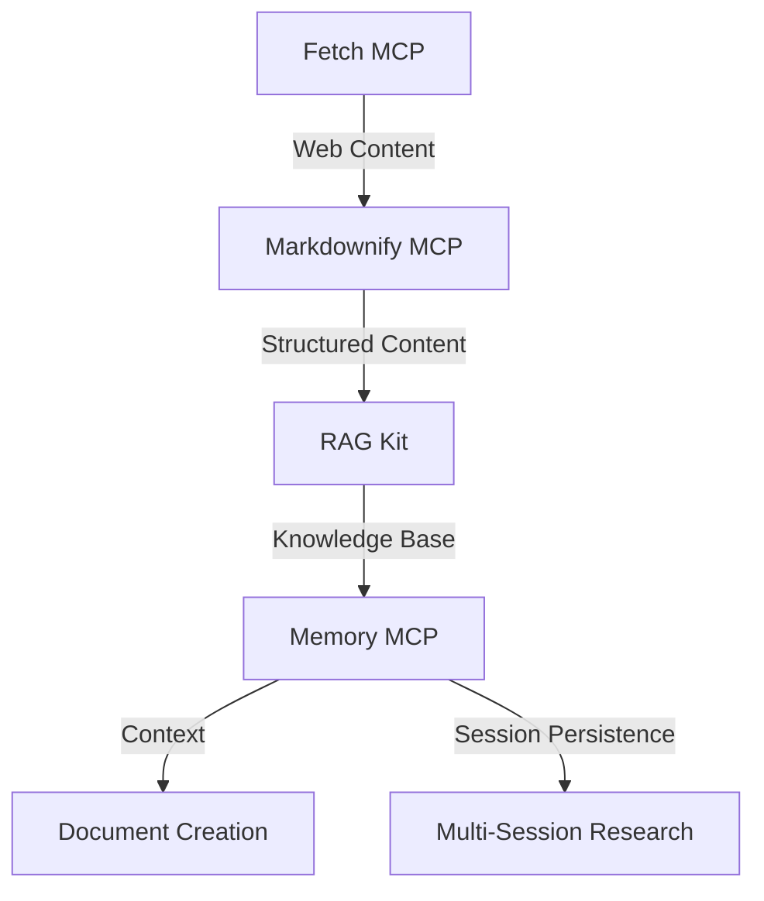

# MCP Integration Overview

## Introduction

MetaMCP integrates various Model Context Protocol (MCP) servers to provide a comprehensive development, research, and productivity environment. This section documents the available MCPs, how they're categorized, and how they work together to accelerate workflows.

## Integration Philosophy

MCPs are designed to be composable, with each server providing a specific capability that can be combined with others to create powerful workflows. Key principles of our integration approach:

1. **Separation of Concerns**: Each MCP handles a specific type of functionality
2. **Seamless Composition**: MCPs work together through a unified interface
3. **Contextual Awareness**: MCPs share context to provide cohesive experiences
4. **Extensibility**: New MCPs can be added easily to extend system capabilities
5. **Memory Persistence**: Context is maintained across sessions through dedicated memory servers

## MCP Categories

We group MCPs into the following categories:

### [Development](categories/development/overview.md)

Tools for code editing, version control, and software development.

| Key MCPs | Primary Functions |
|----------|-------------------|
| [Text Editor MCP](categories/development/code-editors.md) | File editing and manipulation |
| [Windows CLI MCP](categories/development/code-editors.md) | Command-line interaction and system management |
| [Git MCP](categories/development/git-tools.md) | Version control operations |
| [Python REPL MCP](categories/development/repl-environments.md) | Python code execution and testing |
| [Source Sage MCP](categories/development/code-analysis.md) | Code understanding and navigation |

### [Research](categories/research/overview.md)

Tools for information gathering, analysis, and knowledge management.

| Key MCPs | Primary Functions |
|----------|-------------------|
| [Fetch MCP](categories/research/web-fetch.md) | Web content retrieval |
| [RAG Kit](categories/research/rag-systems.md) | Retrieval augmented generation |
| [Markdownify MCP](categories/research/web-fetch.md) | Content format conversion |
| [Knowledge Base MCP](categories/research/knowledge-management.md) | Information organization |

### [Productivity](categories/productivity/overview.md)

Tools for task management, communication, and document creation.

| Key MCPs | Primary Functions |
|----------|-------------------|
| [Google Kit](categories/productivity/communication-tools.md) | Email and calendar integration |
| [Memory MCP](categories/productivity/task-management.md) | Context and task persistence |
| [Claude Prompts MCP](categories/productivity/document-creation.md) | Content generation |

### [Data Processing](categories/data-processing/overview.md)

Tools for data analysis, visualization, and database operations.

| Key MCPs | Primary Functions |
|----------|-------------------|
| [Data Analysis MCP](categories/data-processing/data-analysis.md) | Statistical analysis |
| [Visualization MCP](categories/data-processing/visualization.md) | Data visualization |
| [Database MCP](categories/data-processing/database-tools.md) | Database operations |

## Recently Added MCP Servers

We have expanded our MCP ecosystem with powerful new servers:

### Memory MCP Server

The Memory MCP Server provides a knowledge graph-based persistent memory system that enables context sharing between different MCPs and across sessions.

**Key Features**:
- Entity and relation management
- Observation storage and retrieval
- Graph querying capabilities
- Session persistence across token limits

**Configuration**:
```json
{
  "memory": {
    "command": "npx",
    "args": ["-y", "@modelcontextprotocol/server-memory"],
    "type": "STDIO"
  }
}
```

### Python REPL MCP Server

The Python REPL MCP Server provides an interactive Python execution environment directly within MetaMCP.

**Key Features**:
- Run Python code directly
- Maintain session state between executions
- Capture stdout/stderr for analysis
- Integrate with other MCPs for seamless workflows

**Configuration**:
```json
{
  "python-repl": {
    "command": "uv",
    "args": ["run", "python-local"],
    "type": "STDIO"
  }
}
```

## Combining MCPs for Workflow Acceleration

The true power of MetaMCP comes from combining multiple MCPs to accelerate specific workflows. For example:

### Enhanced Development Workflow



This integration allows for rapid code-test-commit cycles with persistent context and session continuity across token limits.

### Advanced Research Workflow



This integration streamlines the research process from information gathering to knowledge synthesis with persistent memory across multiple sessions.

## Integration Examples

To see detailed examples of how MCPs are combined to accelerate specific workflows:

- [Development Pipeline](integration-examples/development-pipeline.md)
- [Research Workflow](integration-examples/research-workflow.md)
- [Capital Raise](integration-examples/capital-raise.md)

## Adding New MCPs

MetaMCP is designed to be extensible. New MCPs can be added by:

1. Installing the MCP server (typically via npm, pip, or other package managers)
2. Creating a configuration for the MCP server
3. Importing the configuration via the MetaMCP UI or config files
4. Testing the connection and integration with other MCPs

See the [Development Guide](../development/contributing.md) for detailed instructions on adding new MCPs.

## SDK Integration

MetaMCP now features tight integration with the MCP TypeScript SDK, providing:

1. **Standardized Communication**: Consistent protocol-compliant interactions with all MCP servers
2. **Unified Client Interface**: Common interface for working with diverse MCP servers
3. **Transport Abstraction**: Support for both STDIO and SSE-based MCP servers
4. **Error Handling**: Robust error management and reporting
5. **Capability Discovery**: Automatic detection and exposition of MCP server capabilities

### Windows CLI MCP Server

The Windows CLI MCP Server provides secure command-line interaction with multi-shell support (PowerShell, CMD, Git Bash) and robust security controls.

**Key Features**:
- Multi-shell support for different command environments
- Security controls for command execution
- SSH integration for remote system access
- Command history and logging capabilities

**Configuration**:
```json
{
  "win-cli": {
    "command": "npx",
    "args": ["-y", "@simonb97/server-win-cli"],
    "type": "STDIO"
  }
}
```

## Recommended MCP Server Integrations

Based on an analysis of available MCP servers, we recommend the following integrations to enhance MetaMCP's capabilities:

### Development Enhancement

#### AiDD (Development Workflows)

The AiDD MCP Server provides comprehensive development workflow capabilities to enhance context persistence for code-focused sessions.

**Key Features**:
- File system operations with security controls
- Multi-language code analysis using tree-sitter
- Git operations for project state tracking
- Code execution in various languages

**Integration Value**:
- Enhanced code context preservation
- Improved context prioritization for development sessions
- Better understanding of code relationships

**Configuration**:
```json
{
  "aidd": {
    "command": "uvx",
    "args": ["mcp-server-aidd"],
    "description": "AI-driven development workflow tools with code analysis, git operations, and execution capabilities.",
    "type": "STDIO"
  }
}
```

#### Source Sage

Source Sage provides visualization of project structures and file content documentation.

**Key Features**:
- Project directory structure visualization
- File content documentation with syntax highlighting
- Flexible exclusion patterns

**Integration Value**:
- Better project structure understanding and visualization
- Enhanced context for structural relationships between files

### Memory Enhancement

#### Vector Similarity MCPs

Integrating vector-based similarity allows for more intelligent context prioritization:

**Benefits**:
- Link API documentation with related code semantically
- Determine the most relevant information to persist based on semantic similarity
- Improve context retrieval with semantic search capabilities

### Token Management

#### Python MCP with Token Awareness

The Python MCP provides token-aware code extraction and context management.

**Key Features**:
- Smart code extraction to stay within token limits
- Import relationship discovery
- Token-efficient code formatting

**Integration Value**:
- More efficient use of token budget
- Better preservation of code context within token limits

## Integration Strategy

We recommend a phased integration approach:

### Phase 1: Core Memory Infrastructure
- Continue with Knowledge Graph Memory as the primary persistence mechanism
- Implement the Session Manager component
- Build the Token Monitor for limit detection

### Phase 2: Enhanced Capabilities
- Integrate AiDD for better development context
- Add vector embedding capabilities for semantic similarity
- Implement token-aware context extraction

### Phase 3: Advanced Features
- Add Source Sage for structure visualization
- Implement expert systems for context enhancement
- Build feedback loops for continuous improvement

## Security Considerations

For all file system operations, we enforce strict security controls:

- **Logging**: All file operations are logged for audit and monitoring
- **Permission System**: Path-based access controls restrict file operations to allowed directories
- **Restricted Operations**: Write operations (write_file, create_directory) are disabled by default
- **Workspace Isolation**: File operations are confined to workspace boundaries

These controls ensure that MetaMCP maintains security while providing powerful context management capabilities.
